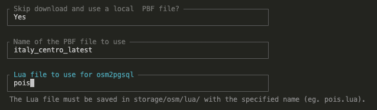

## INSTALL

First of all install the [GEOBOX](https://github.com/webmappsrl/geobox) repo and configure the [ALIASES command](https://github.com/webmappsrl/geobox#aliases-and-global-shell-variable).
Replace `${instance name}` with the instance name (APP_NAME in .env file)

```sh
git clone git@github.com:webmappsrl/osmfeatures.git osmfeatures
git flow init
```

Important NOTE: remember to checkout the develop branch.

```sh
cd osmfeatures
bash docker/init-docker.sh
docker exec -u 0 -it php81_osmfeatures bash
chown -R 33 storage
```

_Important NOTE_: if you have installed XDEBUG you need to create the xdebug.log file on the docker:

```bash
docker exec -u 0 -it php81_osmfeatures bash
touch /var/log/xdebug.log
chown -R 33 /var/log/
```

At the end run install command to for this instance

```bash
geobox_install osmfeatures
```

_Important NOTE_:

-   Update your local repository of Geobox following its [Aliases instructions](https://github.com/webmappsrl/geobox#aliases-and-global-shell-variable). Make sure that you have set the environment variable GEOBOX_PATH correctly.
-   Make sure that the version of wm-package of your instance is at leaset 1.1. Use command:

```bash
composer update wm/wp-package
```

Finally to import a fresh copy of database use Geobox restore command:

```bash
geobox_dump_restore osmfeatures
```

## Run web server from shell outside docker

In order to start a web server in local environment use the following command:
Replace `${instance name}` with the instance name (APP_NAME in .env file)

```sh
geobox_serve osmfeatures
```

### Known Issues

During the execution of scripts, there might be writing issues on certain folders because by default the user inside the container is `www-data (id:33)` while in the host system the user has an ID of `1000`:

-   CChown/chmod of the folder where you intend to write, eg:

NOTE: To execute the chown command, you might need root privileges. In this case, you need to access the docker container using the specific root user (-u 0). This is also valid for unlocking the ability to write in the /var/log folder for XDEBUG's functioning.

    Use the -u parameter for the docker exec command to specify the user ID, eg as root user (use APP_NAME instead of $appName):

    ```bash
    docker exec -u 0 -it php81_$appName bash
    chown -R 33 storage
    ```

XDEBUG might not find the configured log file in the .ini, thus generating various warnings

-   create a file in `/var/log/xdebug.log` inside phpfpm container and run `chown www-data /var/log/xdebug.log`. Create this file only if you need to debug XDEBUG errors (unable to analyze the code via breakpoints) as it might grow exponentially over time.
-

## Resources

-   [osm data](https://webmappsrl.gitbook.io/osmdata-2.0/)

---

# Documentation for `osmfeatures:sync`

The `osmfeatures:sync` command is the core of `osmfeatures`, which uses osm2pgsql and osmium for the synchronization and processing of OSM (OpenStreetMap) data. This document provides a guide on how to use this command, including parameters, options, and their functions.

## Command Overview

The `artisan osmfeatures:sync` command is designed to be flexible and configurable, allowing developers to specify different options for the import process.

### Command Structure

```bash
osmfeatures:sync {defaultName?} {defaultLua?} {--skip-download} {defaultPbf?}
```

### Parameters and Options

The command supports several parameters and options:

1. **defaultName**: The name of the final file that will be saved after the pbf download.


2. **defaultLua**: IThe name of the .lua file (to be typed without the \*.lua extension) to be used for importing with osm2pgsql. This file must be present in the `storage/app/osm/lua` folder. Required.

3. **Option --skip-download**: If you do not want to download the PBF file again, use this option. NOTE: It is necessary that the PBF file is already present in the `storage/app/osm/pbf` folder.

4. **defaultPbf**: Accepts a URL from which to download the PBF. Not required if using the `--skip-download` option.

## Example of Use

Using the Laravel Prompts package, the `osmfeatures:sync` command guides the user through the available options. It will not be necessary, therefore, to type the entire list of required parameters. For example, if you launch:


```bash
osmfeatures:sync
```

---

In the terminal, a list of options will be displayed:

## 

This example uses the `skip download` option end takes a previously downloaded file from Geofabrik saved in `storage/app/osm/pbf` and named 'italy_centro_latest'. The file is then processed with osm2pgsql using `pois.lua`,which defines the table and columns in the database, in addition to the data that we will import from the previously downloaded .pbf file. NOTE: the lua file must be present in the `storage/app/osm/lua` folder.

In this specific example, the PBF is not downloaded from Geofabrik. If you want to download a new PBF file from Geofabrik, simply answer "No" to the "**Skip Download and use a local PBF file?**" prompt. You will then be asked to enter the URL of the PBF file to download and the name for the file, which will be saved in the `storage/app/osm/pbf` folder.

## Documentation for osm2pgsql and osmium

-   **osm2pgsql**: Used to convert OSM data into a format usable by the PostgreSQL database. Detailed documentation available on [osm2pgsql.org](https://osm2pgsql.org/doc/manual.html).

-   **osmium**: A tool for working with OSM data, used to filter and manipulate data before import. Documentation available on [Osmium Tool](https://osmcode.org/osmium-tool/manual.html).


## Laravel Prompts

The Laravel prompts interface enhances the developer experience by providing an interactive guide through the command options. For more information, refer to the [documentazione di Laravel](https://laravel.com/docs/10.x/prompts#main-content).

---

## Updating and Maintaining OSM Data

A command for updating OSM data has been scheduled. This command is designed to run automatically every day at 00:00, updating the OSM data with the most recent changes. The command is configured to download OSM data for the entire Italy from [Geofabrik](https://download.geofabrik.de/europe/italy.html)and synchronize it with the PostgreSQL database by looping through all the lua files present in the `storage/app/osm/lua` folder.

Moreover, to keep the timestamp of the Hiking Routes updated, a command has been created that updates the data starting from the most recent timestamp of the associated way members. This means that if even one of the way members is modified, the timestamp of the Hiking Routes will be updated. This command is designed to run automatically every day at 03:00 and will update the "updated_at" column of the "hiking_routes" table. The "updated_at_osm" column of the "hiking_routes" table represents the original OSM value of the OpenStreetMap relation.
